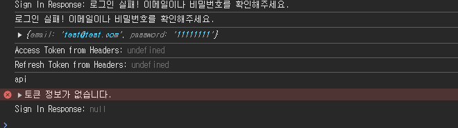

## 🤔 오류 내용
에러로그 함께 입력  
 
백엔드에서 header에 accesstoken을 보내고 있는데 프론트에서 이를 response로 받지 못함. 백엔드에서
 Webconfig.javad에  .exposedHeaders("Authorization")를 추가해주고, 
 SecurityConfig.java에     config.setExposedHeaders(Arrays.asList("Authorization", "Authorization-refresh")); 를 추가해서 클라이언트에서도 javascript로 Header에 있는
 값들을 읽을수 있게끔 설정하여 오류를 해결결

## ⚠ 에러 캡쳐

 
